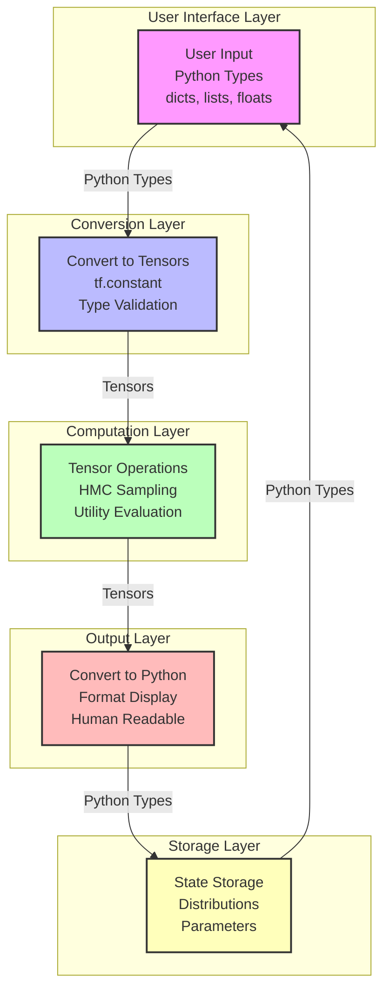

# Aicon Framework: Tools

## Core Concepts

### State Representation

The AIcons framework uses a Bayesian brain-inspired state representation that consists of:

1. **Factor Types**:

   - `ContinuousLatentVariable`: For continuous values (e.g., market_size, conversion_rate)
   - `CategoricalLatentVariable`: For categorical values (e.g., competition_level)
   - `DiscreteLatentVariable`: For discrete values (e.g., num_competitors)
   - `HierarchicalLatentVariable`: A latent variable with hierarchical dependencies on other latent variables.

2. **Factor Relationships**:

   - Root factors: Independent factors with no dependencies
   - Dependent factors: Factors that depend on other factors
   - Hierarchical structure: Parent-child relationships between factors

3. **Distribution Parameters**:
   - Continuous: location, scale, and constraints
   - Categorical: categories and probabilities
   - Discrete: either categories/probs or Poisson rate

Example State:

```
State Representation:
market_size: 10000.00 (constraints: {'lower': 0}) (uncertainty: 1000.00)
competition_level: medium (probs: {'low': 0.2, 'medium': 0.5, 'high': 0.3})
conversion_rate: 0.02 (constraints: {'lower': 0, 'upper': 1}) (uncertainty: 0.01)
customer_acquisition_cost: 50.00 (constraints: {'lower': 0}) (uncertainty: 10.00)
num_competitors: 5 (Poisson rate: 5.0)

Factor Relationships:
market_size:
  Root factor (no dependencies)
competition_level:
  Root factor (no dependencies)
conversion_rate:
  Depends on: ['market_size', 'competition_level']
customer_acquisition_cost:
  Depends on: ['competition_level']
num_competitors:
  Root factor (no dependencies)
```

### Data Flows

The AIcons framework maintains a clear separation between different data types and their transformations throughout the system:



1. **User Interface Layer**:

   - Uses native Python types (dicts, lists, floats) for user interaction
   - Example: `action = {"umbrella": 1.0}`
   - Example: `state = {"market_size": 10000.0, "competition_level": "medium"}`

2. **Conversion Layer**:

   - Converts user inputs to tensors at system boundaries
   - Handles type conversion and validation
   - Example: `action_tensor = tf.constant([action.get(dim.name, 0.0) for dim in self.dimensions])`
   - Example: `state_tensors = {k: tf.constant([v]) for k, v in state_sample.items()}`

3. **Computation Layer**:

   - Uses TensorFlow tensors for all internal computations
   - Maintains consistent tensor types throughout processing
   - Example: `utility_tensor = self.evaluate_tf(action_tensor, state_tensors)`
   - Example: `posterior_samples = self.perception.sample_posterior(observations)`

4. **Output Layer**:

   - Converts tensors back to Python types for display and storage
   - Formats data for user consumption
   - Example: `beliefs[name] = {'value': float(factor.value), 'uncertainty': float(factor.uncertainty)}`
   - Example: `print(f"Mean: {np.mean(samples):.4f}, Std: {np.std(samples):.4f}")`

5. **Storage Layer**:
   - Maintains state in native Python types
   - Stores distributions and parameters
   - Example: `state.factors[factor_name] = {'value': value, 'uncertainty': uncertainty}`
   - Example: `posterior_samples = {'market_size': [10000.0, 10500.0, ...], 'conversion_rate': [0.02, 0.021, ...]}`

This layered approach ensures:

- Clear separation between user interface and computation
- Consistent use of tensors for numerical operations
- Efficient data processing through tensor operations
- Human-readable output and storage
- Type safety and validation at boundaries

### Tools

A tool in the AIcons framework is an external piece of software that helps the AIcon to change the environment somewhere else. Tools are specific implementations that interact with external services or systems. They are the concrete actions that an AIcon can take to affect change in the world.

Examples of tools:

- Meta Ads Creation Tool (creates ads using Facebook Marketing API)
- Twitter Post Tool (posts tweets using Twitter API)
- Email Sending Tool (sends emails using SMTP)

## BaseAicon

The BaseAicon class serves as the foundation for all agent implementations in the AIcons framework. It provides core functionality that all specialized agents can build upon.

### Key Features

- **Bayesian Brain Integration**: Integrates with BayesBrain for probabilistic reasoning
- **State Factor Management**: Handles continuous, categorical, and discrete state factors
- **Hierarchical Modeling**: Supports hierarchical relationships between state factors
- **Sensor Integration**: Connects with sensors for gathering data from the environment
- **Decision Making**: Provides utilities for action space definition and utility optimization

## Zero Model

The Zero model is a simplified version of the AIcon system that focuses on definition and storage rather than active computation. It serves as a foundational model for defining and storing key components without the full computational capabilities of the main AIcon system.

### Key Characteristics

- **Definition-Focused**: Primarily used for defining and storing components rather than active computation
- **Memory Storage**: Maintains state in the form of priors and posteriors
- **Core Components**:
  - Action space definitions
  - Utility function specifications
  - Prior and posterior distributions
  - State factor definitions

### Differences from Full AIcon System

While the full AIcon system includes active decision-making and sensor integration, the Zero model:

- Does not include decision-making capabilities
- Lacks sensor integration
- Focuses on storing definitions and distributions rather than active computation
- Serves as a reference model for defining the structure of more complex AIcon implementations

The Zero model is particularly useful for:

- Defining the structure of more complex AIcon implementations
- Storing and managing state definitions
- Maintaining reference distributions and utility functions
- Providing a foundation for building more sophisticated AIcon systems
